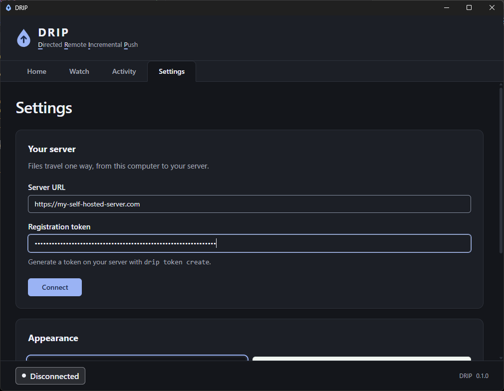

# Drip

**D**irected **R**emote **I**ncremental **P**ush

## About The Project

Drip was built to be a simple and easy to set up file syncing app and will not come with many of the features you find in similar apps.
Things like  _version history_, _bi-directional sync_, and _file sharing links_ etc.. are not present and will never be present.

Drip simply mirrors selected files and folders from your Windows computer to your server. Deletes are also propagated to the mirror.

That's it.

## Features

* One-way sync from your PC (Windows only) to your own self-hosted server.
* File and folder selection (including recursive folder scanning)
* Incremental uploads that only transfers what has changed.
* FastCDC content chucking and BLAKE3 hashing for (hopefully) efficient transfers and integrity checks
* Background operation with Windows system tray controls.

## How it works

1. Run the Drip server using the docker image.
2. Generate a registration token.
   1. The token only lasts for 15 minutes.
3. Start the drip.exe app and select which files and folders to watch.
4. Drip handles the rest.

## How to make it work

### Run the server

Build the docker image first:

```sh
docker build -t drip .
```

Start the server

```sh
docker run -d --name drip -p 8000:8000 -v drip-data:/data drip
```

Drip listens on port 8000 and stores its data in /data, but this can be changed through environment variables.

### Docker environment variables
| Variable | Default | Description |
| --- | --- | --- |
| `DRIP_PORT` | `8000` | Port Drip listens |
| `DRIP_DATA_DIR` | `/data` | Where Drip stores its data. Mount persistent storage here. |

**You must expose the server through an HTTPS reverse proxy. The desktop app requires an HTTPS server URL.**

Generate the registration token:

```sh
docker exec drip node dist/server/bootstrap/cli.js token create
```

### Connect the desktop

1. Start drip.exe, go to settings, type in the https url to the drip server + registration token.
2. Click **Connect**



## Acknowledgements

Drip desktop app is built with [Perry](https://github.com/PerryTS/perry),
which compiles TypeScript to native executables.